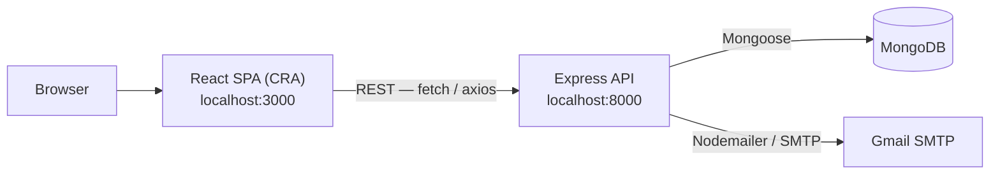

<p align="center">
  
</p>

<h1 align="center">Relay</h1>

<p align="center">
  Supplier relations for teams that buy and sell.
</p>

---

A MERN web application for managing relationships between **Suppliers** and **Buyers**.
Suppliers publish articles (offers); Buyers browse them, leave reviews and ratings, and
record transactions. Aggregated transaction data feeds a supplier performance report.

The objective is to facilitate and optimize supplier relationship management by improving
data quality, transaction traceability, cost and lead-time reduction, and the satisfaction
of internal and external customers.

## Capabilities

- Registration and login for two distinct actor types, with email confirmation
- JWT authentication with a "remember me" long-lived token, and OTP-based password reset
- Supplier directory with CRUD, plus per-supplier article listings
- Article catalogue with embedded reviews and a denormalized rating average
- Standalone supplier ratings, separate from article reviews
- Transaction records (amount spent, deadline met, quality of service)
- A generated supplier performance report derived from transactions

## Architecture

Two independent applications. There is **no root `package.json`** — each app is installed
and run from its own directory.



**Backend request flow:** `server.js` wires middleware (logger → cors → helmet → morgan →
body-parser → cookie-parser), mounts the routers, and ends with `middleware/errorHandler.js`.
Layering is routes → controllers → Mongoose models, with controllers wrapped in
`express-async-handler`.

Routers mounted in `server.js`: `/auth`, `/suppliers`, `/buyers`, `/articles`, `/ratings`,
`/reports`, `/transactions`.

**Identity model — important:** Suppliers and Buyers are **two separate collections**, not
one `User` model with roles. `authController.login` probes `Supplier.exists({username})`
first and falls back to `Buyer`. Anything touching identity must handle both models.
On login the backend issues three tokens: a 15-minute `accessToken`, a 1-day `refreshToken`
set as an httpOnly `jwt` cookie, and a 30-day `longLivedToken` for "remember me".
`middleware/verifyJWT.js` decodes the payload and sets `req.supplierId` **or** `req.buyerId`.

**Route protection:** `/reports` and `/ratings` require a token on every request. On
`/suppliers`, `/buyers`, `/articles` and `/transactions`, all writes (`POST`, `PATCH`,
`DELETE`) require a token while reads stay public, so the catalogue is browsable without a
session. Per-record ownership is **not** yet enforced — see Known issues.

**Frontend state is split across three mechanisms.** Match whichever the file you are
editing already uses:

1. **Context + `useReducer` per domain** — `contexts/{Auth,Suppliers,Buyers,Articles,Ratings}Context.js`,
   consumed through matching `hooks/use*Context.js`. This is the primary pattern.
2. **Redux** (`store.js`, `actions/articleActions.js`, `reducers/articleReducers.js`) — used
   only by the article list / details / review-create flow.
3. **`ContextProvider.js`** — UI-only state (theme, sidebar, popups), read via `useStateContext`.

CORS is restricted by `backend/config/allowedOrigins.js`; only `http://localhost:3000` is
relevant locally.

## Technology stack

Versions below are the ones actually declared in `package.json`.

**Frontend**

<p>
  
  
  
  
  
  
  
  
</p>

**Backend**

<p>
  
  
  
  
  
  
  
</p>

**Tooling**

<p>
  
  
  
  
</p>

Verified from `package.json` and actual imports.

| Layer | Technology |
| --- | --- |
| Frontend | React 17, Create React App 5, react-router-dom 6, Tailwind CSS 3, Syncfusion EJ2 19.4, react-bootstrap, react-icons |
| Frontend state | Redux + react-redux + redux-thunk (articles flow only), React Context + useReducer |
| HTTP client | `fetch` (most pages/hooks) and `axios` (Redux article actions) |
| Backend | Node.js, Express 4, express-async-handler, helmet, morgan, cors, express-rate-limit |
| Database | MongoDB via Mongoose 7 |
| Auth | jsonwebtoken (hand-rolled), bcrypt, otp-generator |
| Email | Nodemailer over Gmail SMTP |
| CI | GitHub Actions (`.github/workflows/ci.yml`) — install, lint, build |
| Tests / Deployment | **None present in this repository** |

Seven unused backend dependencies were removed during the repository audit: `passport`,
`passport-local`, `express-session` (auth is hand-rolled JWT), `mongodb` (redundant beside
Mongoose), `react-hot-toast` (a React library in a backend), and the npm packages `crypto`
and `path`, which shadowed the Node built-ins that the code actually resolves to.

Still installed but unused: `multer` (storage is configured in `server.js` but never attached
to a route, and its `backend/public/assets` destination does not exist) and `validator`. Both
were left in place in case file upload is planned — see `docs/AUDIT.md`.

## Project structure

```text
.
├── backend/                    Express + MongoDB API (port 8000)
│   ├── server.js               Middleware wiring and router mounting
│   ├── config/                 allowedOrigins, corsOptions, dbConn, mailer
│   ├── routes/                 One router per resource
│   ├── controllers/            Request handlers (express-async-handler)
│   ├── models/                 Supplier, Buyer, Article, Rating, Transaction
│   ├── middleware/             errorHandler, logger, loginLimiter, verifyJWT
│   ├── views/                  Static 404 / index pages (unrelated to the SPA)
│   └── .env.example
├── frontend/                   React SPA (port 3000)
│   ├── src/
│   │   ├── config/api.js       API base URL (REACT_APP_API_URL)
│   │   ├── contexts/ hooks/    Per-domain Context + useReducer state
│   │   ├── actions/ reducers/ constants/   Redux, articles only
│   │   ├── components/         Shared UI (partly dashboard-template carryover)
│   │   ├── pages/              Screens — see note below
│   │   └── data/dummy.js       Template sample data + sidebar links and grid configs
│   └── .env.example
├── .github/workflows/ci.yml    CI: install, lint, build for both apps
├── docs/
│   ├── AUDIT.md                Repository audit, ambiguities, technical debt
│   └── assets/relay-logo.png   Project logo used in this README
├── LICENSE                     MIT (Syncfusion components are separately licensed)
└── README.md
```

**Domain code vs. template carryover.** The frontend shell (Sidebar, Navbar, ThemeSettings,
`data/dummy.js`, Syncfusion charts and Kanban) comes from a third-party dashboard template.
Real domain work lives in `pages/{Suppliers,Buyers,Articles,ArticlesHome,ArticlesList,AddArticle,UpdateSupplier}`,
all of `pages/auth/`, and the `contexts/` + `hooks/` + Redux article files. `pages/{Calendar,Kanban,Ecommerce}`
and `components/{Cart,Chat,Notification,UserProfile,Charts/*}` are unmodified template code
rendering hardcoded sample data — they are still routed and reachable, but are not part of
the domain.

### Data models

- **Supplier**, **Buyer** — parallel, independent collections
- **Article** — belongs to a supplier; embeds a `reviews` subdocument array plus denormalized
  `rating` / `numReviews`
- **Rating** — standalone supplier↔buyer rating, separate from article reviews
- **Transaction** — buyer/supplier refs with `amountSpent`, `deadlineMet`, `qualityOfService`;
  the sole input to `POST /reports/generate-report`

## Prerequisites

- Node.js 16+ and npm
- A running MongoDB instance (local or Atlas)
- SMTP credentials — the mailer is configured for Gmail, so an **App Password** is required

## Installation

```bash
# Backend
cd backend
npm install
cp .env.example .env      # then fill in real values

# Frontend
cd ../frontend
npm install
cp .env.example .env
```

## Configuration

### `backend/.env`

| Variable | Purpose |
| --- | --- |
| `PORT` | Intended API port. **Currently ignored** — see Known issues. |
| `MONGO_URI` | MongoDB connection string |
| `ACCESS_TOKEN_SECRET` | Signs the 15-minute access token and the 30-day long-lived token |
| `REFRESH_TOKEN_SECRET` | Signs the 1-day refresh token stored in the `jwt` cookie |
| `SMTP_USER` | SMTP account used by `config/mailer.js` |
| `SMTP_PASS` | SMTP app password |
| `SMTP_FROM` | Sender address on confirmation and password-reset emails |

### `frontend/.env`

| Variable | Purpose |
| --- | --- |
| `REACT_APP_API_URL` | Backend base URL. Defaults to `http://localhost:8000` if unset. |
| `ESLINT_NO_DEV_ERRORS` | Keeps ESLint warnings from failing the dev server |

Never commit a real `.env`; both are gitignored.

## Running locally

Two terminals:

```bash
# Terminal 1 — API on http://localhost:8000
cd backend
npm run dev        # nodemon;  `npm start` runs it without watch

# Terminal 2 — SPA on http://localhost:3000
cd frontend
npm start
```

The frontend expects the backend to be reachable at `REACT_APP_API_URL`, and the backend
only accepts browser origins listed in `config/allowedOrigins.js`.

## Testing

**There are currently no tests in this repository.**

- `frontend`: `npm test` is wired to `react-scripts test` (Jest), but no test files exist and
  no `@testing-library/*` package is installed, so the command has nothing to run. Adding
  tests requires installing the testing-library dependencies first.
- `backend`: no test script and no test framework.
- Linting: `cd frontend && npm run lint` (or `npm run lint:fix` to auto-correct). This uses
  `frontend/.eslintrc.js` (airbnb, with formatting rules relaxed to warnings). Note that
  `package.json` also carries a CRA `eslintConfig` block; the two do not fully agree.
- No Prettier config and no type checking (plain JavaScript, no TypeScript).

## Build

```bash
cd frontend
npm run build      # production bundle in frontend/build/
```

The build passes. CRA 5 runs `eslint-webpack-plugin` against `frontend/.eslintrc.js` during
the build; the pure-formatting rules there (`semi`, `indent`, `quotes`, `react-in-jsx-scope`
and similar) are set to `warn` rather than `error`, because the existing source predates that
config and produces ~1,380 style violations. Correctness rules — `no-unused-vars`, the React
hooks rules, accessibility — remain errors and will fail the build.

To adopt the strict airbnb style later, run `npm run lint:fix` and raise those rules back to
`error` in `.eslintrc.js`. That reformats nearly every file, so it is best done as its own
isolated commit.

The backend is plain Node.js and has no build step — it is run directly with `node server`.

## Deployment

**No deployment configuration exists in this repository.** There are no Dockerfiles, no
`docker-compose`, and no cloud/infrastructure manifests. `.github/workflows/ci.yml` runs
continuous integration only (install, lint, build) — it does not deploy anywhere. The
application has only ever been configured to run locally.

Anything required for a real deployment — process management, a production MongoDB, HTTPS,
secret management, and replacing the hardcoded `http://localhost:3000` links in confirmation
and password-reset emails — still has to be designed.

## Environment separation

Only **local/development** exists today. There is no test, staging, or production
configuration, and no mechanism for per-environment settings beyond the two `.env` files.

## Known issues

These are verified against the code and left unchanged deliberately; fixing them changes
runtime behaviour and needs an owner decision. See `docs/AUDIT.md` for the full list.

- **`PORT` from `.env` is ignored.** `server.js` evaluates `process.env.PORT || 8000` *before*
  `dotenv.config()` runs, so the server always binds 8000.
- **`/suppliers/bydomain` and `/suppliers/filter` are unreachable.** `/:supplierId` is
  declared first in `routes/supplierRoutes.js`, so the param route swallows both literal paths.
- **No per-record ownership checks.** Write routes now require a valid token, but any
  authenticated user can still modify records they do not own. Reads remain public.
- **Password reset does not actually reset a password.** The frontend now calls the correct
  endpoint with the payload the handler expects, but `authController.resetPassword` looks the
  account up by email, generates a *new* reset token and emails another reset link — it never
  writes `newPassword`. The flow reaches the server and returns 201, but the password is
  unchanged. Fixing this is a business-logic decision; see `docs/AUDIT.md`.
- **A non-"remember me" session does not survive a reload.** `useLogin` writes to the
  `localStorage` key `user`, but `App.js` rehydrates only from `rememberMe`.
- **Email links are hardcoded** to `http://localhost:3000` in `authController.js`.
- **`multer` uploads would fail.** `server.js` configures an upload destination of
  `backend/public/assets`, and `backend/public/` does not exist. The `upload` middleware is
  never attached to a route, so this is currently inert.
- **`craco.config.js` is dead.** `@craco/craco` is not installed and the scripts call
  `react-scripts` directly; Tailwind runs through CRA's own PostCSS. Editing the craco config
  has no effect.
- **`/bar` throws.** `App.js` renders `pages/Charts/Bar.jsx` without the `compareData` prop it
  calls `.flatMap()` on.
- **Syncfusion runs unlicensed** (no `registerLicense` call), so its components render trial
  watermarks.

## Troubleshooting

- **Backend starts but nothing responds / no data.** `config/dbConn.js` catches connection
  errors with a bare `console.log` and lets the process continue, so a bad `MONGO_URI` looks
  like a silent failure rather than a crash. Check the startup output for a Mongo error.
- **Frontend requests fail with a CORS error.** Confirm you are browsing on
  `http://localhost:3000`; other origins are rejected by `config/allowedOrigins.js`.
- **Registration succeeds but no email arrives.** Verify `SMTP_USER` / `SMTP_PASS` in
  `backend/.env`. Gmail requires an App Password, not the account password.
- **Confirmation link does not work.** See the route-mismatch entry under Known issues.
- **Changing the backend host.** Set `REACT_APP_API_URL` in `frontend/.env` and restart the
  dev server — CRA reads `.env` only at startup.

---

<p align="center">
  Built with ❤️ by Hamdi Khsib
</p>
